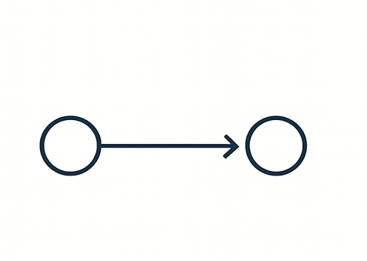
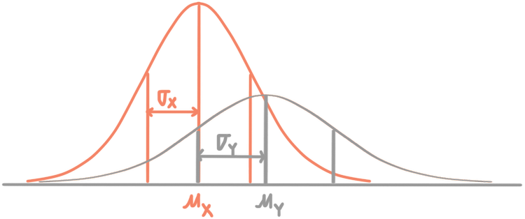
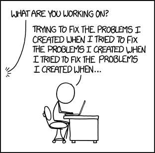
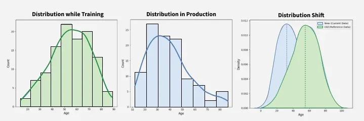
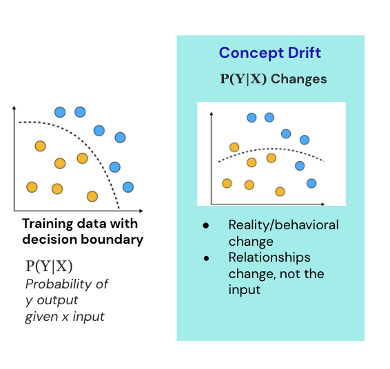
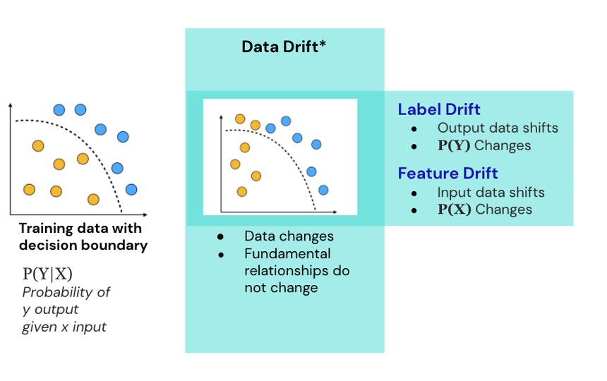
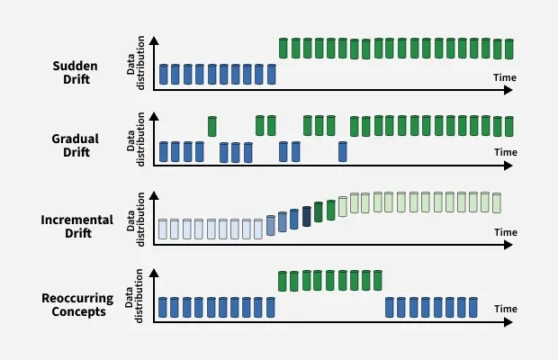
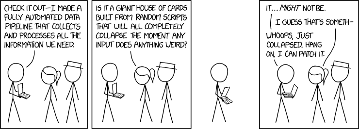
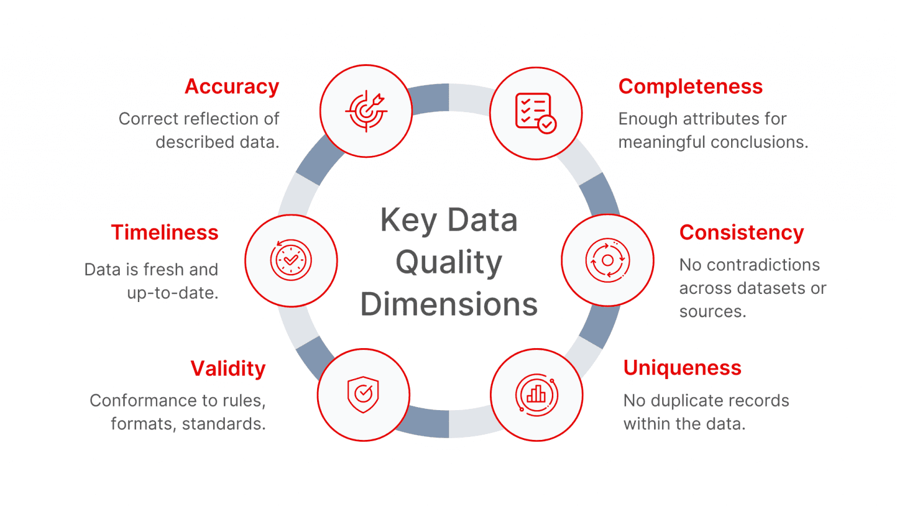
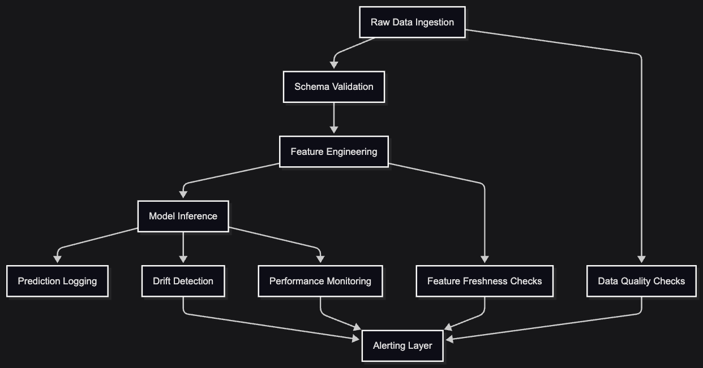

<style>
  img[alt~="center"] {
    display: block;
    margin: 0 auto;
  }
</style>

<style>
.small-center {
  font-size: 0.7em;
  text-align: center;
}
</style>

<style>
.large-center {
  font-size: 2em;
  text-align: center;
}
</style>

<!-- Intro Slide -->
<!-- _paginate: skip -->

## The 80/20 of ML Monitoring

##### Pietro Mascolo

###### Bologna, 2026-05-28

&nbsp;
&nbsp;
&nbsp;
&nbsp;


> What Actually Matters in ML Systems
> http://bit.ly/4dfU5lf


<!-- Welcome and set the tone: this talk is not “intro to dashboards.” We’re going to cover the small number of things that actually matter in real ML monitoring. Emphasize that monitoring is not MLOps fluff — it's core to responsible modeling. -->

---

## What We’ll Cover

- Why ML monitoring
- Failure signals that matter
- A lean and robust monitoring architecture
- Python-first tools
- Deep dive: drift, skew, freshness, quality, degradation
- Common pitfalls

<!-- Frame the narrative: the goal is clarity and discipline. We will focus on what is universal across orgs, not on vendor-specific solutions. -->

---

## Why This Talk Exists

The traditional approach:

- log predictions
- build pretty dashboards (that no one will ever use fully)
- pray nothing breaks

<!-- But real systems fail due to distributional instability, not exceptions. -->

<!-- Goal: Show the minimal set of signals that predict >80% of real failures, and the architecture that supports them.

[Placeholder: iceberg diagram (“visible failures” vs “invisible drift”)] -->

<!-- Explain the empirical reality: the majority of ML production failures come from data issues and unnoticed drift. Most teams dramatically overestimate what dashboards catch and underestimate pipeline rot. Set expectation: this talk prioritizes conceptual rigor over tooling worship. -->

---

# Why Traditional Monitoring Fails for ML

ML changes because the world changes.


---

# Traditional monitoring - assumptions

---

## Stable requirements


---

## Deterministic logic



---

## Static invariants


---

# The real world of ML

---

## Stochastic spaces


---

## Shifting distributions



---

## Unclear objectives


<!-- Different rules, different failure modes.

[Placeholder: dataset shifting timeline] -->

<!-- Give an example: fraud models degrade because fraudsters adapt, not because code breaks. Monitoring ML is not about uptime — it’s about epistemic uncertainty. -->

---

## What fails

&nbsp;
&nbsp;
&nbsp;
&nbsp;

It’s rarely the model...
&nbsp;
&nbsp;
&nbsp;
&nbsp;
&nbsp;
&nbsp;
&nbsp;

---

## What fails

* data pipeline schema drift
* training-serving mismatch
* feature staleness
* fundamental concept drift
* corrupted ingestion
* misaligned evaluation
* feedback loop instability

---

## You need a plan



<p class="small-center">Source: https://xkcd.com/1739/</p>

<!-- Lean into the “data-centric” message: Monitoring models is downstream — catching issues after impact. Monitoring data lets you catch issues before predictions degrade. -->

---

# The Signals That Matter

---

## The 80/20 signals

&nbsp;

* Data Drift
* Training–Serving Skew
* Feature Staleness
* Performance Degradation
* Data Quality / Pipeline Breakage

---

# 1. Data Drift

&nbsp;
&nbsp;
&nbsp;
&nbsp;
&nbsp;
&nbsp;
&nbsp;
&nbsp;
&nbsp;
&nbsp;
&nbsp;
&nbsp;



<!-- ---

## Data drift

&nbsp;

###### Distribution shift between training and production inputs.

&nbsp;

Why it matters:
Even small shifts can have multiplicative downstream effects. -->

---

## 1. Data Drift: concept drift



---

## 1. Data Drift: feature/label drift



---

## 1. Data Drift: how it can appear



<!-- &nbsp;

Covariate drift (feature distributions shift)
Prior drift (class frequencies shift) -->

<!-- Aspect	Concept Drift	Covariate Drift
Change in	The relationship between input (X) and output (Y)	The distribution of input features (X)
Output Behavior	For the same input, the expected output may change over time	Output behavior remains the same, only input patterns change
Model Impact	Directly affects model accuracy due to outdated learned relationships	May affect model generalization if unseen input patterns dominate
Adaptation Strategy	Retrain the model using new data reflecting the changed relationship	Ensure training data covers a representative input distribution -->

<!-- ### Tools & signals:

KL divergence, PSI, KS test
Embedding drift (advanced)
Statistical consistency checks

[Placeholder: distribution comparison diagram] -->

<!-- Highlight the limitations of simple metrics like PSI, and suggest monitoring multiple drift signals. Advanced teams use representation models for multimodal or high-dimensional drift detection. -->

---

## Drift Check (Evidently)

```python
from evidently.report import Report
from evidently.metric_preset import DataDriftPreset

report = Report(metrics=[DataDriftPreset()])
report.run(reference_data=train_df, current_data=prod_df)
results = report.as_dict()
```

---

<style scoped>
h1 {
  color: white;
}
</style>

# 2. Training–Serving Skew

&nbsp;
&nbsp;
&nbsp;
&nbsp;
&nbsp;
&nbsp;
&nbsp;
&nbsp;
&nbsp;
&nbsp;
&nbsp;
&nbsp;


---

## Training–Serving Skew

### Symptoms

- Model behaves well offline → terrible in production
- Predictions drift or suddenly degrade
- Debugging harder than it should be

---

## Training–Serving Skew

### Causes

- Different preprocessing between training & inference
- Feature drift over time
- Silent schema changes
- Code inconsistencies

---

## Training–Serving Skew: goal

> ##### Make both environments deterministic and aligned.

<!-- Speaker Notes
This slide introduces the problem in plain terms: the model saw one world during training and a different one during inference. Juniors often miss that preprocessing mismatch is responsible for most “my model sucks in prod” complaints. Emphasize that alignment is a systems problem, not a modeling problem. -->


<!-- Emphasize: this is the failure mode that embarrasses teams. Most skew happens because feature engineering is duplicated instead of centralized. -->

---

## Training–Serving Skew: Concrete Example
Training preprocessing (Python)

```python
# training_step.py

df["income_log"] = np.log(df["income"] + 1)
df["age_bucket"] = (df["age"] // 10) * 10
df = df.fillna(df.mean(numeric_only=True))
```

Serving preprocessing (FastAPI endpoint)

```python
# inference.py

income_log = math.log(user.income) # missing +1 handling
age_bucket = round(user.age / 10) * 10 # different logic
income = user.income if user.income else 0
```

---

## Training-Serving Skew: practical strategy
Shared data transformation module

```python
# features.py
import numpy as np

TRAIN_MEAN = ...

def income_log(income: float) -> float:
    return np.log(income + 1)

def age_bucket(age: float) -> int:
    return (age // 10) * 10

def impute(value):
    return value or TRAIN _MEAN
```

---

```python
# test_features.py

from hypothesis import given, strategies as st

@given(st.floats(min_value=0, max_value=1e6))
def test_income_log_properties(x):
    y = income_log(x)

    # invariants
    assert y >= 0
    assert isinstance(y, float)
    assert income_log(x + 1) >= y  # monotonicity
```

---

## Pipeline consistency check

```python
# gross oversimplification

def hash_pipeline(funcs):
    import hashlib
    return hashlib.sha256(
        "".join(f.name for f in funcs).encode()
    ).hexdigest()

assert train_pipeline_hash == serving_pipeline_hash
```
---


## Skew Prevention Checklist (Use Before Every Release)

* Same transformations in training & serving?
* Same categorical mappings?
* Same feature defaults and missing-value rules?
* Same data types? (int vs float is a real bug)
* Same ordering? (sorted vs unsorted lists break embeddings)
* Contract tests passing?
* Synthetic tests run on both pipelines?
* Shared module regenerated after spec changes?

---

## 3. Feature Staleness

&nbsp;

&nbsp;
&nbsp;
&nbsp;
&nbsp;
&nbsp;
&nbsp;
&nbsp;
&nbsp;
&nbsp;


---

## Feature staleness: what causes it

Input signals stop reflecting current reality,  while the model assumes they are ok.

Common causes (unrelated to data drift):

- delayed batch jobs
- broken upstream pipelines
- cached feature stores
- API data lag
- silent ingestion failures

---

## Feature Staleness: Practical Detection

Rule-based freshness check

```python
from datetime import datetime, timedelta

def is_stale(feature_timestamp, max_age_hours=6):
    return datetime.utcnow() - feature_timestamp > timedelta(hours=max_age_hours)
```

Batch check over dataset

```python
stale_features = df[df["timestamp"] < cutoff_time]
stale_ratio = len(stale_features) / len(df)

# trigger
if stale_ratio > 0.1:
    raise Warning("Feature freshness degraded")
```

<!-- Make clear: freshness monitoring is the least glamorous but the most ROI. Most production failures in industry tie back to stale or lagged features. -->

---

<style scoped>
h1 {
  color: #362f87;
}
</style>

# 4. Performance Degradation

&nbsp;
&nbsp;
&nbsp;
&nbsp;
&nbsp;
&nbsp;
&nbsp;
&nbsp;
&nbsp;
&nbsp;
&nbsp;
&nbsp;
&nbsp;
&nbsp;
&nbsp;


---

## Model performance is the lagging indicator of system health

Causes:

- real-world behavior shift
- upstream feature corruption
- label distribution changes
- feedback loops
- seasonal effects
- direct evaluation may be impossible
- proxies may misrepresent ground truth
- multi-objective systems degrade unevenly

By the time performance drops, the root cause already happened upstream.

---

## Performance Monitoring

Offline evaluation (baseline)

```python
from sklearn.metrics import roc_auc_score

auc = roc_auc_score(y_true, y_pred)
```

Production evaluation (delayed labels)

```python
def compute_live_auc(preds, labels):
    return roc_auc_score(labels, preds)
```

Rolling degradation tracking

```python
if current_auc < baseline_auc - 0.05:
    alert("Performance degradation detected")
```

<!-- Stress that performance monitoring is downstream. It’s necessary but not sufficient — without upstream monitoring, it’s too late. -->

---

## 5. Data Quality & Pipeline Integrity

&nbsp;
&nbsp;
&nbsp;
&nbsp;
&nbsp;
&nbsp;
&nbsp;
&nbsp;
&nbsp;
&nbsp;
&nbsp;
&nbsp;
&nbsp;



<p class="small-center">Source: https://xkcd.com/2054/</p>

---

## Typical issues

* missing columns
* schema drift
* invalid ranges
* corrupted rows
* duplicated data
* type mismatches

If data is wrong, model evaluation is meaningless.


---

## Data quality




---

## Data validation

```python
import pandera as pa

schema = pa.DataFrameSchema({
    "age": pa.Column(int, checks=pa.Check.in_range(0, 120)),
    "income": pa.Column(float, nullable=True),
    "user_id": pa.Column(str),
})


# Validation step
schema.validate(df)
```


<!-- Explain that data quality issues often masquerade as “model issues” but are unrelated to ML. This is the foundation layer of monitoring. -->


<!-- Stress that the power comes from simplicity and control. Large MLOps platforms often obscure what’s going on — bad for debugging. -->

---

## Flow



---

# Principles of Effective ML Monitoring

---

## Key principles

Good:

- detect early
- stay simple
- focus on signals, not dashboards
- cheap to run
- easy to reason about
- have a clear baseline for **everything**

---

## Key principles

Bad:

- generate noise
- focus on just dashboards and visualisations
- depend on vendor tooling
- hide logic behind abstractions
- are impossible to debug

<!-- Track signals, not dashboards
Baseline everything
Automate quickly, tune slowly
Prove actionability before visualization
Avoid black-box monitoring tools
Keep the system smaller than your ability to understand it -->
<!-- Close the conceptual loop. The monitoring system must be controllable, interpretable, and maintainable. -->

---

## Anti-Patterns to Avoid

❌ Monitoring hundreds of metrics → alert collapse
❌ Reacting to noise instead of signals
❌ Monitoring the model without monitoring the data
❌ “Just add a dashboard” culture
❌ No baselines → meaningless drift checks
❌ Hard-coded thresholds
❌ One-shot evaluations

<!-- Deliver this slide with blunt clarity. Every advanced team has suffered these issues. You’re showing them how to skip the first two years of mistakes. -->

---

## Useful tools

Great expectations → Data quality 
Evidently → drift & data quality
River → online drift detectors
MLflow → performance + metric logging
FastAPI → monitoring endpoints / orchestration
Airflow / cron → run periodic checks


---

## What You Can Do This Week

- Add drift detection to one model
- Add freshness checks to your critical features
- Align training & serving preprocessing
- Introduce baselines for data quality tests
- Stand up a simple monitoring API
- Create a single “model health” page

<p class="large-center">Small wins compound.</p>

<!-- Give them achievable actions. The goal is to convert the talk into momentum. -->

---

## Q&A


> ## Any questions?

&nbsp;
&nbsp;
&nbsp;
&nbsp;
&nbsp;
&nbsp;
&nbsp;
&nbsp;
&nbsp;

<!-- Invite advanced questions. Encourage scenario-based discussion. -->
